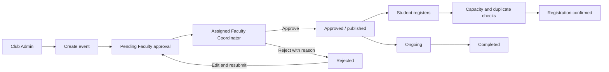
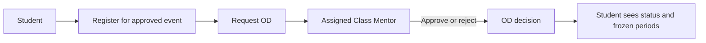
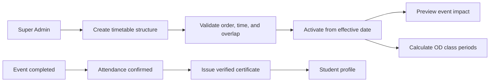
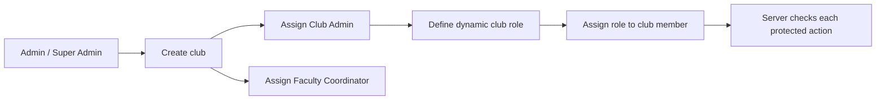
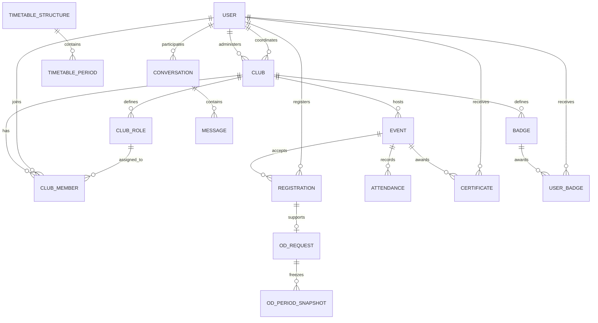

# Hackathon Feature and Workflow Guide

## Coverage status

### Implemented in this codebase

- SQLite persistence and foreign-key enforcement; email/password authentication; role checks on protected backend routes.
- Club creation, updates, active/inactive archive state, Club Admin assignment, Faculty Coordinator assignment, membership, and dynamic club roles.
- Event draft submission to the assigned Faculty Coordinator, approval/rejection with a reason, resubmission, approved-only student registration, capacity and duplicate checks, and start/complete/cancel transitions.
- Student registration confirmation, decision notifications, audit entries, and Faculty/Club Admin messages tied to an event where appropriate.
- OD requests tied to the student's approved registration and Class Mentor, decision state, and stored period snapshots.
- Super Admin managed timetable structures with ordered periods, class/break types, duration calculation, overlap/order checks, working days, effective dates, activation checks, gap warnings, and an event overlap preview.
- Attendance, 10-minute event check-in codes for registered students, verified PDF certificates, badge definitions and awards, student certificate/badge pages, and in-app notifications.
- Club and student analytics, approval queue, demo accounts, and seed data.

### Partial or not implemented yet

- Student Google Sign-In is not configured. The current sign-in uses email and password.
- Certificates do not yet store a participation label such as Winner/Volunteer, provide a per-club visual template, or support one-click bulk issue.
- QR check-in, student event ratings, treasury, venue booking, portfolio export, and other creative extras are not implemented.
- Analytics are basic operational summaries; they need broader edge-case review and a polished visualization.
- A clean database gets the student RA format constraint; existing SQLite databases receive equivalent insert/update validation triggers. Always use the seed accounts or create students with exactly 15 ASCII letters/numbers.
- Google Drive packaging, a public GitHub repository, a demo recording, and judge checklist still need to be prepared by the team.

## Workflow diagrams

### Event approval and registration

### OD request

### Timetable and certificate

### Role assignment

## Data model overview

## Demo setup sequence

1. Start the backend and frontend using the README commands.
2. Sign in as Admin or Super Admin. Admin tools show user IDs; create the Club Admin and Faculty accounts first if needed.
3. Create a club and assign its Club Admin and Faculty Coordinator IDs.
4. Sign in as Super Admin, create/activate a timetable structure, and review overlap validation.
5. Sign in as Club Admin and submit an event. Sign in as the assigned Faculty account to approve or reject it.
6. Sign in as Student to register and request OD. Sign in as the student's Class Mentor to decide OD.
7. As Club Admin, open Attendance, select the seeded **Campus Welcome Mixer**, and generate a live check-in code. Enter it as the pre-registered `student2@college.edu` account.
8. Mark attendance, move an event through Ongoing to Completed after its scheduled time, then issue a certificate or badge.

## Known submission gaps

This document is a code coverage guide, not proof that the team has submitted. The team still needs to create the public repository, record a demo of no more than 25 minutes, upload the repository ZIP and video to a link-accessible Drive folder, and submit the links through the required form. Do not include `.env`, live credentials, or real student records in the ZIP.
